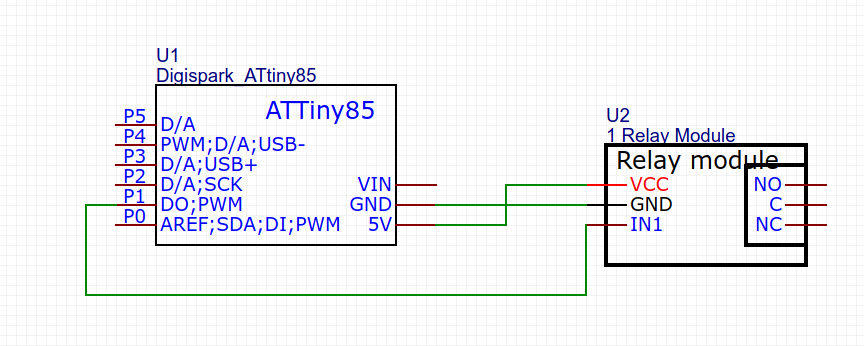

# USBRelay

This is the most simple USB-Relay possible. It Uses an ATTYINY85 Digispark Board and an simple Chinese relay to complete the Task.

## Protocol

Request: `1x char`
```
TURN_OFF  = "0" or 0x30
TURN_ON   = "1" or 0x31
TOGGLE    = "2" or 0x32
GET_STATE = "3" or 0x33
IDENT     = "9" or 0x39
```

Answer: `1x char`
```
STATE_OFF  = "0" or 0x30
STATE_ON   = "1" or 0x31
IDENT      = "r" or 0x72
```

## Schematics


